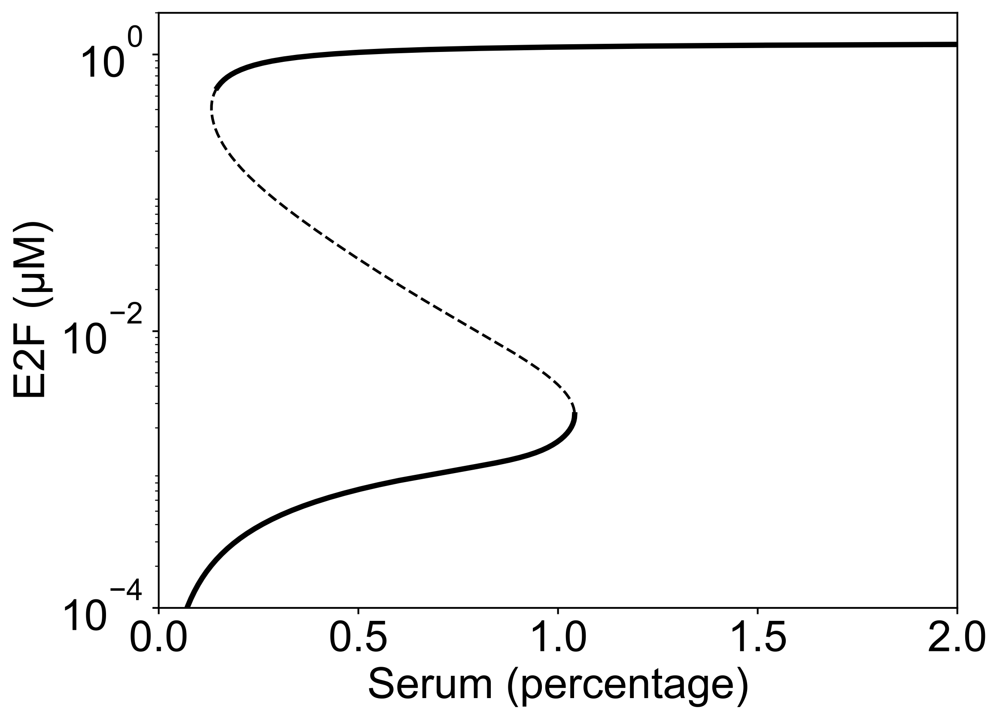

# Bifurcation Analysis

A numerical study of the changes in the dynamics and stability of a system upon variations in its parameters.


## Procedure for stability analysis at fixed points

Consider the following system of ordinary differential equations:

```math
\dfrac{dx}{dt} = F(x)
```

1. Determine the fixed point vector, ``x^*``, solving ``F(x^*) = 0``

1. Construct the Jacobian matrix, ``J(x) = \dfrac{\partial F(x)}{\partial x}``

1. Compute eigenvalues of ``J(x^*)``: ``|J(x^*) − λE| = 0``

1. Conclude on stability or instability of ``x^*`` based on the real parts of eigenvalues
    - All eigenvalues have real parts less than zero → ``x^*`` is stable
    - At least one of the eigenvalues has a real part greater than zero → ``x^*`` is unstable

## Usage

Here I would like to use a mathematical model of Rb–E2F pathway ([Yao et al., 2008](https://www.nature.com/articles/ncb1711)) to show you how to perform bifurcation analysis with [`BioMASS.jl`](https://github.com/biomass-dev/BioMASS.jl).

### Prepare `name2idx/` to define model species and parameters

- See [examples](https://github.com/biomass-dev/BioMASS.jl/tree/master/examples/bifurcation/restriction_point/name2idx).

### Create `set_model.jl`

In this file, you will need to prepare four functions:

- `diffeq!`: Ordinary differential equations of the model.
- `param_values`: Model parameters.
- `get_derivatives`: ``\dfrac{\partial F(x)}{\partial bp}``, where ``bp`` is the bifurcation parameter (x-axis).
- `get_steady_state`: Function to equilibrate the system.

### Run `create_diffeq` function

```julia
create_diffeq(".")
```

Then you will get `forwarddiff.jl` file in your model folder.

### Load requirements

```julia
using DelimitedFiles
using Sundials
using SteadyStateDiffEq
using PyPlot

include("./name2idx/parameters.jl")
include("./name2idx/species.jl")
include("./set_model.jl")
include("./forwarddiff.jl")

const BP = C.S      # name(index) of bifurcation parameter (x-axis)

const SN = V.NUM    # num of state variables
const PN = 1        # num of parameters
const VN = SN + PN  # num of variables
```

### Calculate fixed points and analyze their stability

After executing `new_curve!` function, you will get `data/fp.dat` and `data/ev.dat` files, where they contain fixed points and eigenvalues, respectively.

```julia
function calc_fixed_point_vec(model_path::String)::Tuple{Array,Array}
    global p = param_values()
    new_curve!(
        model_path, p, diffeq, get_derivatives, get_steady_state,
        direction=false, bifparam=BP, n_state=SN
    )
    fp::Array = readdlm(joinpath(model_path, "data", "fp.dat"), '\t', Float64, '\n')
    ev::Array = readdlm(joinpath(model_path, "data", "ev.dat"), '\t', Float64, '\n')
    br::Array = get_bistable_regime(ev, SN)

    return fp, br
end
```

### Plot results

```julia
function bifurcation_diagram(model_path::String, fp::Array, br::Array)
    rc("figure", figsize=(8, 6))
    rc("font", family="Arial")
    rc("font", size=24)
    rc("axes", linewidth=1)
    rc("xtick.major", width=1)
    rc("ytick.major", width=1)
    rc("lines", linewidth=3)

    plot(fp[1:br[1]-1, VN+1], fp[1:br[1]-1, V.E+1], "k-")
    plot(fp[br, VN+1], fp[br, V.E+1], lw=1.5, "k--")
    plot(fp[br[end]+1:end, VN+1], fp[br[end]+1:end, V.E+1], "k-")

    xlabel("Serum (percentage)")
    ylabel("E2F (μM)")

    xlim(0, 2)
    xticks([0, 0.5, 1, 1.5, 2])
    yscale("log")
    ylim(1e-4, 2)
    yticks([1e-4, 1e-2, 1])

    savefig(joinpath(model_path, "bifurcation_diagram.pdf"), bbox_inches="tight")
    close()
end
```

### Run all functions defined above

```julia
const MODEL_PATH = "."

fp, br = calc_fixed_point_vec(MODEL_PATH);
bifurcation_diagram(MODEL_PATH, fp, br);
```



*Stable (solid) and unstable (dashed) steady states of E2F activity with respect to serum stimulation.*

For more examples, please refer to [examples/bifurcation](https://github.com/biomass-dev/BioMASS.jl/tree/master/examples/bifurcation).
