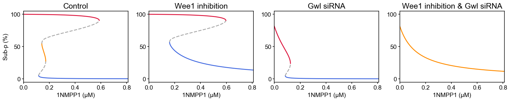

# Bifurcation Analysis

A numerical study of the changes in the dynamics and stability of a system upon variations in its parameters.



## Procedure for stability analysis at fixed points

Consider the following system of ordinary differential equations:

```math
\dfrac{dx}{dt} = F(x)
```

1. Determine the fixed point vector, ``x^*``, solving ``F(x^*) = 0``

1. Construct the Jacobian matrix, ``J(x) = \dfrac{\partial F(x)}{\partial x}``

1. Compute eigenvalues of ``J(x^*)``: ``|J(x^*) − λE| = 0``

1. Conclude on stability or instability of ``x^*`` based on the real parts of eigenvalues
    - All eigenvalues have real parts less than zero → ``x^*`` is stable
    - At least one of the eigenvalues has a real part greater than zero → ``x^*`` is unstable

## Usage
See [examples/bifurcation](https://github.com/biomass-dev/BioMASS.jl/tree/master/examples/bifurcation).