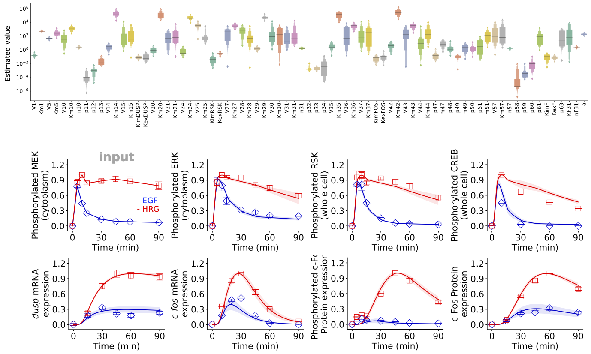

# Parameter Estimation



## Core functions

---

**load_model**(`path_to_model`::String)

Load a BioMASS model. The model must include the following files:

| Name                   | Content                                                                                                  |
| :--------------------- | :------------------------------------------------------------------------------------------------------- |
| `name2idx/`            | Names of model parameters and species                                                                    |
| `set_model.jl`         | Differential equation, parameters and initial condition                                                  |
| `observalbe.jl`        | Model observables for correlating simulation results with experimental observations                      |
| `simulation.jl`        | Simulation condition                                                                                     |
| `experimental_data.jl` | Experimental measurements for determining parameters                                                     |
| `set_search_param.jl`  | Model parameters to optimize and search region                                                           |
| `fitness.jl`           | An objective function to be minimized, i.e., the distance between model simulation and experimental data |

- **Parameters**

  - `path_to_model`::String
    - The model folder to read.

- **Returns**
  - `model`::ExecModel
    - The executable model in BioMASS.

---

**optimize**(`model`::ExecModel, `index_of_parameter_set`::Int; `popsize`::Int=5, `max_generation`::Int=10000, `allowable_error`::Float64=0.0, `n_children`::Int=50, `local_search_method`::String="mutation")

Find a parameter set that reproduces experimental observations.

- **Parameters**

  - `model`::ExecModel

    - The model read by `load_model` function.

  - `index_of_parameter_set`::Int

    - Index of parameter sets.

  - `popsize`::Int (default: 5)

    - A multiplier for setting the total population size. The population has popsize \* len(search_param) individuals.

  - `max_generation`::Int (default: 10000)

    - The maximum number of generations over which the entire population is evolved.

  - `allowable_error`::Float64 (default: 0.0)

    - Optimization stops when Best Fitness <= allowable_error.

  - `n_children`::Int (default: 50)

    - The number of children used for local search NDM/MGG ("mutation").

  - `maxiter`::Int (default: 10)

    - The maximum number of iterations over which the entire population is evolved. This is used for the local search methods: "Powell" or "DE".

  - `local_search_method`::String (default: `"mutation"`)

    - Local search method used in GA. Should be one of
      - `"mutation"` : NDM/MGG
      - `"Powell"` : Modified Powell method
      - `"DE"` : Differential Evolution (strategy: `best2bin`)

---

**visualize**(`model`::ExecModel, `viz_type`::String, `show_all`::Bool=false, `stdev`::Bool=false)

Save simulation results with optimized parameter values.

- **Parameters**

  - `viz_type`::String

    - `"average"`
    - `"best"`
    - `"original"`
    - `"experiment"`

  - `show_all`::Bool (default: `false`)

    - Whether to show all simulation results.

  - `stdev`::Bool (default: `false`)

    - If True, the standard deviation of simulated values will be shown
      (only available for `"average"` visualization type).

  - `save_format`::String (default: `"pdf"`)
    - Either "png" or "pdf", indicating whether to save figures as png or pdf format.

---

**param2biomass**(`path_to_model`::String)

Convert optimized parameters (`fitparam/`) and optimization process (`logs/`) into BioMASS format (`out/`).

- **Parameters**

  - `path_to_model`::String
    - The model folder including optimization results.

## Estimate unknown model parameters

```julia
using BioMASS

model = load_model("./examples/fos_model")

optimize(model, 1, popsize=3, allowable_error=0.35, local_search_method="powell")
```

## Simultaneous parameter optimization

### Using module `Distributed`

```julia
using Distributed
addprocs(); # add worker processes
@everywhere using BioMASS

@everywhere begin
    model = load_model("./examples/fos_model")
    function optimize_parallel(i)
        optimize(model, 1, popsize=3, allowable_error=0.35, local_search_method="powell")
    end
end

pmap(optimize_parallel, 1:10)
```

### Calling multiple bash scripts

- main.jl

```julia
using BioMASS

model = load_model("./examples/fos_model")

if abspath(PROGRAM_FILE) == @__FILE__
    optimize(model, 1, max_generation=20000, allowable_error=0.5)
end
```

- optimize_parallel.sh

```bash
#!/bin/sh

for i in $(seq 1 10); do
    nohup julia main.jl $i >> errout/$i.log  2>&1 &
done

# To terminate the process,
# $ pgrep -f main.jl | xargs kill -9
```

Run optimize_parallel.sh

```bash
$ mkdir errout
$ sh optimize_parallel.sh
```

## How to track optimization process

The temporary result will be saved in `path_to_model/logs/n.log` after each iteration.

```bash
$ tail examples/fos_model/logs/1.log
```

## Visualization of simulation results

The simulation results will be saved in `figure/`.

```julia
visualize(model, viz_type="best", show_all=true)
```

## Conversion of optimized parameters into BioMASS format


The converted items will be saved in `path2model/dat2npy/out/`.

```julia
param2biomass("./examples/fos_model")
```
