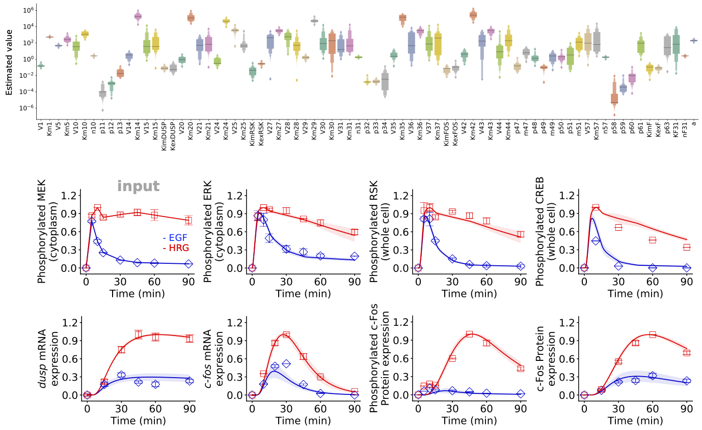

# Parameter Estimation



## Core functions

---

### Model(`path_to_model`::String)

Load a BioMASS model. The model must include the following files:

| Name                   | Content                                                                                                  |
| :--------------------- | :------------------------------------------------------------------------------------------------------- |
| `name2idx/`            | Names of model parameters and species                                                                    |
| `ode.jl`               | Differential equation, parameters and initial condition                                                  |
| `observalbe.jl`        | Model observables for correlating simulation results with experimental observations                      |
| `simulation.jl`        | Simulation condition                                                                                     |
| `experimental_data.jl` | Experimental measurements                                                                                |
| `search_param.jl`      | Lower and upper bounds of model parameters to be estimated                                               |
| `problem.jl`           | An objective function to be minimized, i.e., the distance between model simulation and experimental data |

- **Parameters**

  - `path_to_model`::String
    - The model folder to read.

- **Returns**
  - `model`::Model
    - The executable model in BioMASS.

!!! note
    [`pasmopy.Text2Model`](https://pasmopy.readthedocs.io/en/latest/model_development.html) allows you to build a BioMASS model from text [[Imoto et al., 2022](https://www.cell.com/iscience/fulltext/S2589-0042(22)00214-0)]. You simply describe biochemical reactions and the molecular mechanisms extracted from text are converted into an executable model. To build a model for BioMASS.jl, please set `lang="julia"`.

---

### scipy\_differential\_evolution(`model`::Model, `ix_id`::Int, `kwargs`...)

Estimate model parameters from experimental data.

- **Parameters**

  - `model`::Model

    - Model for parameter estimation.

  - `x_id`::Int

    - Index of parameter set to estimate.

  - `kwargs`...

    - Keyword arguments to pass to [`scipy.optimize.differential_evolution`](https://docs.scipy.org/doc/scipy/reference/generated/scipy.optimize.differential_evolution.html.).
---

### run\_simulation(`model`::Model, `viz_type`::String, `show_all`::Bool=false, `stdev`::Bool=false)

Save simulation results with optimized parameter values.

- **Parameters**

  - `viz_type`::String

    - `"average"`
    - `"best"`
    - `"original"`
    - `"experiment"`

  - `show_all`::Bool (default: `false`)

    - Whether to show all simulation results.

  - `stdev`::Bool (default: `false`)

    - If True, the standard deviation of simulated values will be shown
      (only available for `"average"` visualization type).

  - `save_format`::String (default: `"pdf"`)
    - Either "png" or "pdf", indicating whether to save figures as png or pdf format.

## Estimate unknown model parameters

```julia
using BioMASS

model = Model("./examples/fos_model");
initpop = generate_initial_population(model)
scipy_differential_evolution(model, 1, init=initpop)
```

## Simultaneous parameter optimization

### Using module `Distributed`

```julia
using Distributed
addprocs(); # add worker processes
@everywhere using BioMASS

@everywhere begin
    model = Model("./examples/fos_model")
    function optimize_parallel(i)
        scipy_differential_evolution(model, i)
    end
end

pmap(optimize_parallel, 1:10)
```

### Calling multiple bash scripts

- main.jl

```julia
using BioMASS

model = Model("./examples/fos_model")

if abspath(PROGRAM_FILE) == @__FILE__
    scipy_differential_evolution(model, parse(Int64, ARGS[1]))
end
```

- optimize_parallel.sh

```bash
#!/bin/sh

for i in $(seq 1 10); do
    nohup julia main.jl $i >> errout/$i.log  2>&1 &
done

# To terminate the process,
# $ pgrep -f main.jl | xargs kill -9
```

Run optimize_parallel.sh

```bash
$ mkdir errout
$ sh optimize_parallel.sh
```

## How to track optimization process

The temporary result will be saved in `path_to_model/fitparam/n/optimization.log`.

```bash
$ tail examples/fos_model/fitparam/1/optimization.log
```

## Visualization of simulation results

The simulation results will be saved in `figure/`.

```julia
run_simulation(model, viz_type="best", show_all=true)
```
